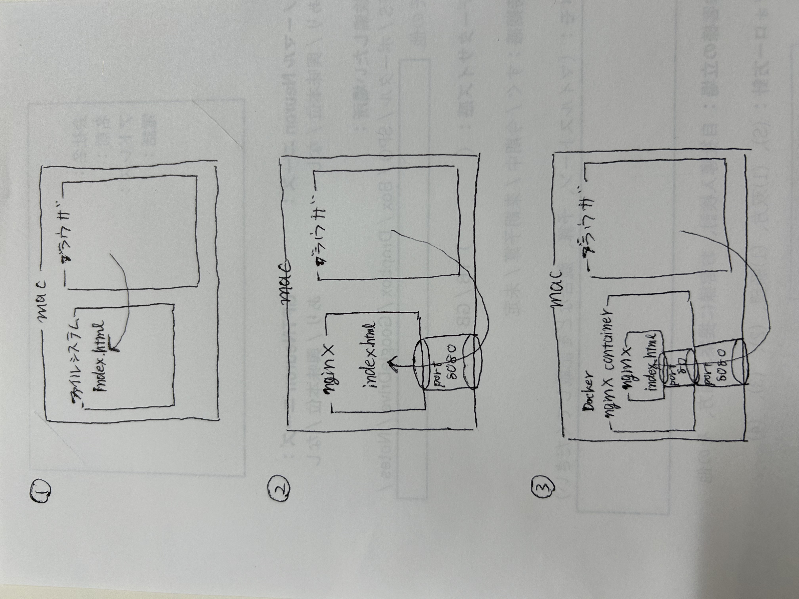

# Web
## Webサーバーについて
### Webページがブラウザで表示できる仕組み
1. ブラウザはユーザが指定したURLをDNS(Domain Name System)サーバーに問い合わせて、グローバルIPアドレスを返してもらう。
2. ブラウザはもらったグローバルIPアドレスへリクエストを送る。
3. Webサーバーはリクエストに対してhtml/cssやjavascriptなどのファイルをブラウザへ返す
4. ブラウザはもらったhtml/cssやjavascriptなどのファイルをもとに画面表示をレンダリングする

## ブラウザでのHTMlファイルの表示
### ファイルサーバーへの直接アクセスによるhtmlの表示
ブラウザから`File:/"htmlファイルのパス"`と入力するとhtmlファイルの記述に従ってページが表示される

Tips:
- `File:/`はPC内のファイルを参照する通信の規格指定をしている。

### ローカルで起動したnginxへのlocalhost経由アクセスによるhtmlの表示

### 

コンテナを使うメリットはコンテナを切り替えるだけで新しい環境に移行できる保守性もある
メモ
- brew services
- `which`コマンドはある特定の場所を検索する
- 
